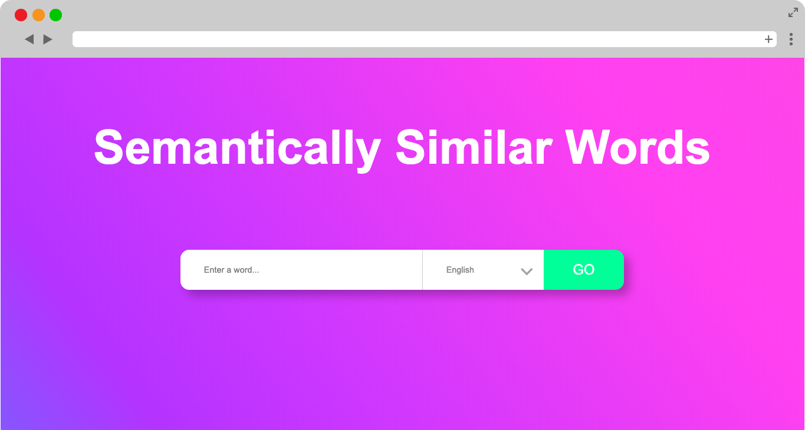
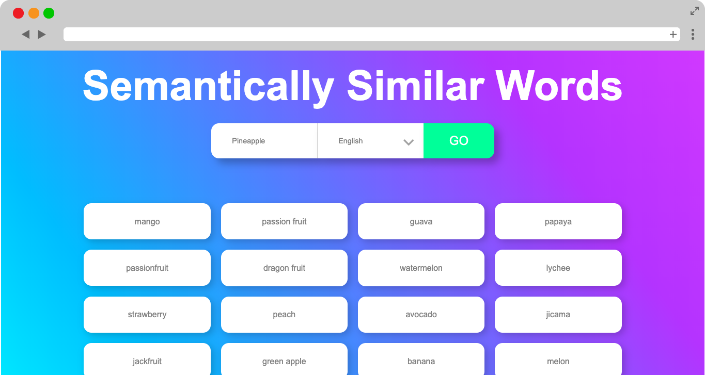
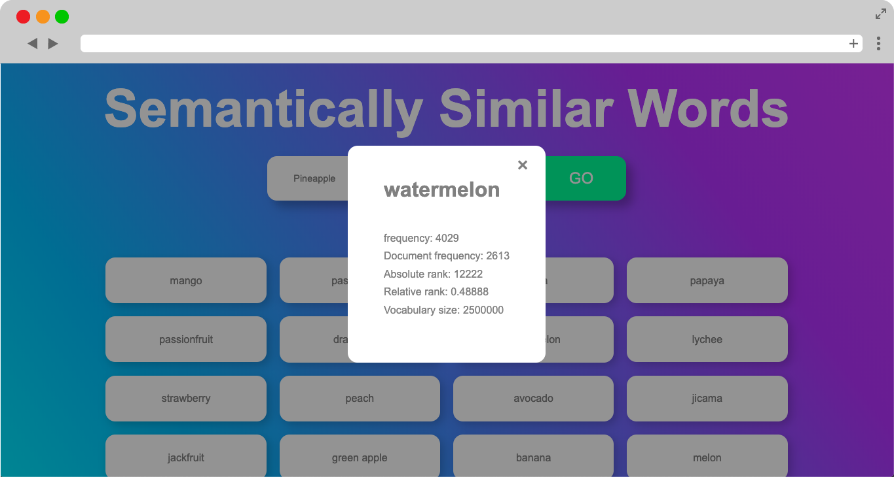
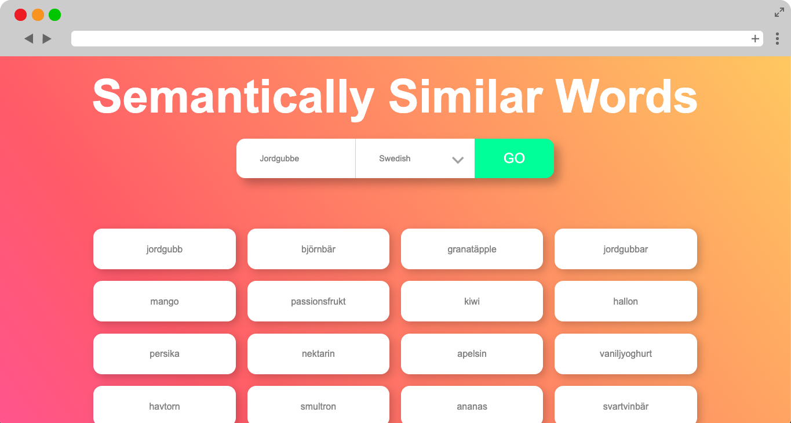

# Implementation of Lexicon API

I wanted to see how I could play with subtle and simple animations to enhance user experience. 
So I decided to do this through implementing Gavagai's Lexicon API to see how I could make searching in 
a lexicon more fulfilling. The lexicon exists in 46 different languages.

Link: https://adamseidtahir-gavagai.herokuapp.com/index.html
